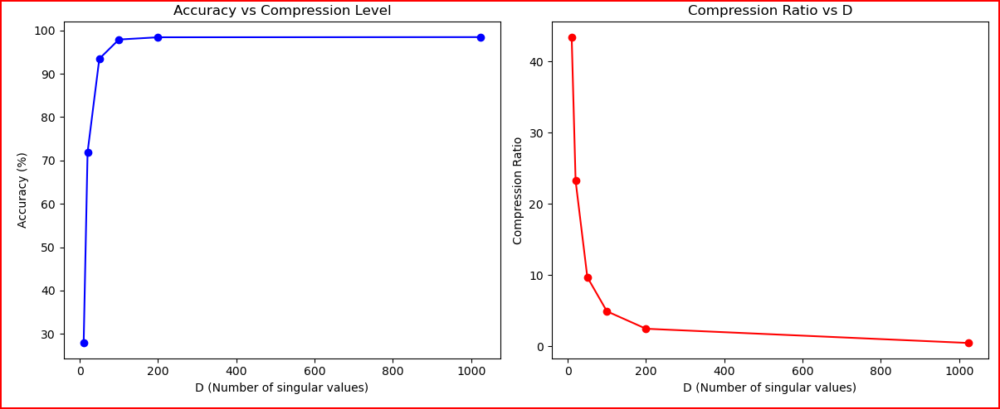
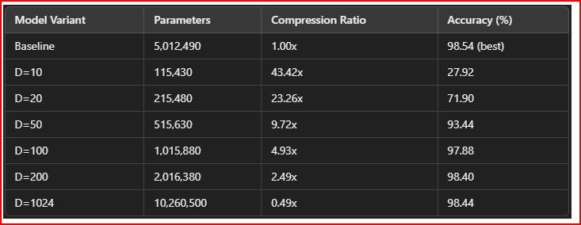
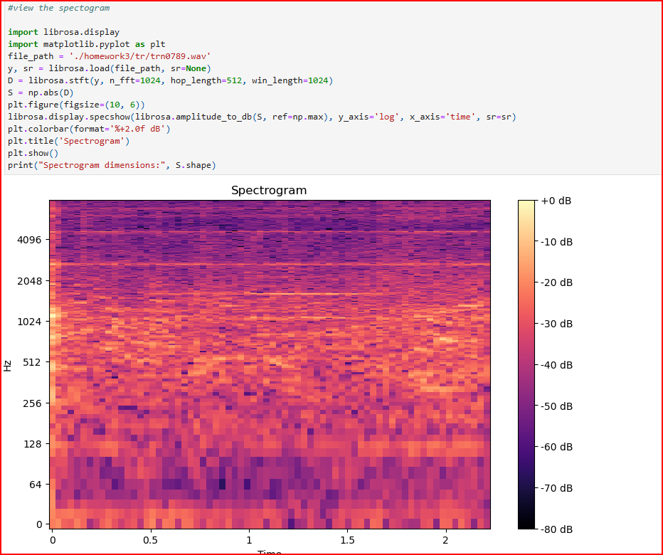

# Deep Learning Systems - Assignment 3

PyTorch implementation of model compression, audio denoising, and speaker recognition using neural networks.

## Results

### MNIST Classification
- **Baseline Model**: 5,012,490 parameters
- **Best Accuracy**: 98.54% (50 epochs, dropout 0.2)
- **Loss**: 0.2964 → 0.0332 (final)



### Model Compression
- **D=10**: 115,430 params (43.42× compression, 27.92% accuracy)
- **D=20**: 215,480 params (23.26× compression, 71.90% accuracy)
- **D=50**: 515,630 params (9.72× compression, 93.44% accuracy)
- **D=100**: 1,015,880 params (4.93× compression, 97.88% accuracy)



### Audio Denoising
- **Method**: STFT/ISTFT spectral processing (n_fft=1024, hop_length=512)
- **SNR Computation**: `10 * log10(signal_power / noise_power)`
- **Note**: Best model saved during training to handle overfitting



### Speaker Recognition
- **Architecture**: GRU encoder (input_size=513, hidden_size=256, bidirectional)
- **Siamese Network**: L2-normalized embeddings for cosine similarity

## Project Structure

```
├── A3-DLS-1.html          # Jupyter notebook (all solutions)
├── data/                   # Datasets (MNIST, audio files)
├── results/                # Denoised audio outputs
└── models/                 # Saved checkpoints (.pth files)
```

## Technologies

- PyTorch
- librosa (STFT/ISTFT, audio processing)
- torchvision (MNIST)
- NumPy, matplotlib

## Key Implementations

1. **Low-Rank Factorization**: Compressed fully-connected layers using W ≈ UV^T
2. **Spectral Audio Processing**: STFT → neural network → ISTFT reconstruction
3. **Training Pipeline**: Adam optimizer (lr=0.001), CrossEntropyLoss, best model checkpointing

## Usage

```python
# Train baseline MNIST model
baseline_model = BaselineMNISTClassifier()
train(baseline_model, train_loader, test_loader, epochs=50)

# Compress model
compressed_model = CompressedModel(baseline_model, D=20)

# Audio denoising
spectrogram = librosa.stft(audio, n_fft=1024, hop_length=512)
denoised = model(spectrogram)
audio_out = librosa.istft(denoised, hop_length=512)
```

## Files

- `A3-DLS-1.html`: Complete notebook with Q1-Q5 solutions
